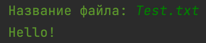
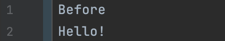
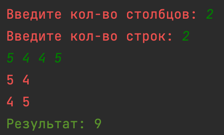
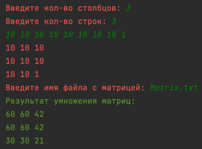

# Московский Авиационный Институт
## Отчет по лабораторной работе по учетной дисциплине  
## Программирование
###
###  
###
### Выполнил ст. гр. М3В-237Бк-22 Мин Д.В.  
###  
###  Задание
1. Чтение информации с клавиатуры и вывод на экран.  
2. Чтение информации с клавиатуры и запись в файл.  
3. Чтение информации из файла и вывод на экран.  
4. Чтение информации с клавиатуры и запись в начало файла.
5. Создание массива и вывод на экран.
6. Чтение массива с клавиатуры и вывод на экран.
7. Создание массива генератором случайных значений и вывод на экран.
8. Создание массива генератором случайных значений в диапазоне.
9. Вывести вектор в обратной последовательности.
10. Отсортировать вектор.
11. Найти минимальное\максимальное значение.
12. Найти НОД.
13. Сравнение сумм векторов. Вывод вектора с наибольшей суммой.
14. Создание матрицы.
15. Удаление столбца.
16. Транспонирование матрицы.
17. Вычеркнуть главную диагональ.
18. Замена колонки в матрице.
19. Поиск кратного и замена на 0.
20. Поиск детерминанта матрицы.
21. Умножение матриц.
22. Замена строк матрицы.
23. Сортировка матрицы методом Шелла.
24. Сортировка матрицы методом пузырька.
25. Сортировка матрицы методом вставок.
26. Сортировка матрицы методом выбора.
27. Сортировка матрицы методом кучи.
28. Вывести форматированный текст.
29. Вывести псевдографикой таблицу.
30. Считать строку из файла. Вычеркнуть из неё символы полученные из клавиатуры.
31. Выполнить поиск строки в файле в режиме не полного соответствия. Вывести номер последней строки удовлетворяющей условию.
32. Вывести строку в формате бегущей строки двигающейся в обратном направлении.
33. Создать графический объект - квадрат.
34. Вписать треугольник в круг, с радиусом считанным с клавиатуры.
35. Построить гистограмму соответствующую вектору считанному с клавиатуры.
36. Вывести матрицу, пометив цветом только максимальное и минимальное значение.
37. Вывести матрицу считанную из файла, раскрасив строки.
38. Вывести матрицу считанную из файла, раскрасив столбцы.
39. Вывести отсортированную матрицу, раскрасив градиентом.
#  
### Реализация классов
**App** - главный класс программы
```java
public class App {
    public static void main(String[] args) {
        PrinterMenu printerMenu = new PrinterMenu();
        Scanner scanner = new Scanner(System.in);
        Controller controller = new Controller(printerMenu, scanner);
        controller.mainPage();
    }
}
```
**Printer** - абстрактный класс, отвечающий за печать в консоль.
```java
public abstract class Printer {
    public static final String BLACK = "\u001B[30m";
    public static final String RED = "\u001B[31m";
    public static final String GREEN = "\u001B[32m";
    public static final String BLUE = "\u001B[34m";
    public static final String YELLOW = "\u001B[33m";
    public static final String PURPLE = "\u001B[35m";
    public static final String CYAN = "\u001B[36m";
    public static final String WHITE = "\u001B[37m";

    public void print(String string) {
        System.out.println(string);
    }

    public void print(Integer integer) {
        System.out.println(integer);
    }

    public void printListString(List<String> list) {
        list.forEach(System.out::println);
    }

    public void printListInt(List<Integer> list) {
        System.out.println(list);
    }

    public void printErrorCommand() {
        System.out.println(RED + "Неверная команда!");
    }

    public void printErrorInput() {
        System.out.println(RED + "Ошибка при вводе!");
    }

    public void printEnter() {
        System.out.print(GREEN + "Введено: ");
    }

    public void printResult() {
        System.out.print(GREEN + "Результат: ");
    }

    public void printMatrix(int[][] matrix) {
        for (int[] ints : matrix) {
            for (int anInt : ints) {
                System.out.print(anInt + " ");
            }
            System.out.print("\n");
        }
    }

    public void printMaxMinColorMatrix(int[][] matrix, int max, int min) {
        for (int i = 0; i < matrix.length; i++) {
            for (int j = 0; j < matrix[0].length; j++) {
                if (matrix[i][j] == max || matrix[i][j] == min) {
                    System.out.print("\u001B[3" + (i + j) + "m" + matrix[i][j] + " ");
                } else {
                    System.out.print("\u001B[00m" + matrix[i][j] + " ");
                }
            }
            System.out.println();
        }
    }

    public void printRowsColor(int[][] matrix, int input) {
        for (int i = 0; i < matrix.length; i++) {
            for (int j = 0; j < matrix[0].length; j++) {
                System.out.print("\u001B[3" + (i + input) + "m" + matrix[i][j] + " ");
            }
            System.out.println();
        }
    }

    public void printColsColor(int[][] matrix) {
        for (int i = 0; i < matrix.length; i++) {
            for (int j = 0; j < matrix[0].length; j++) {
                System.out.print("\u001B[3" + checkNegative(j, matrix[0][0]) + "m" + matrix[i][j] + " ");
            }
            System.out.println();
        }
    }

    public void printGradientMatrix(int[][] matrix) {
        List<Integer> diagonal = checkDiagonal(matrix);
        for (int i = 0; i < matrix.length; i++) {
            for (int j = 0; j < matrix[0].length; j++) {
                System.out.print("\u001B[3" + checkLastIndex(diagonal.get(i)) + "m" + matrix[i][j] + " ");
            }
            System.out.println();
        }
    }

    private List<Integer> checkDiagonal(int[][] matrix) {
        List<Integer> arr = new ArrayList<>();
        for (int i = 0; i < matrix.length; i++) {
            for (int j = 0; j < matrix[0].length; j++) {
                if (i == j)
                    arr.add(matrix[i][j]);
            }
        }
        return arr;
    }

    private int checkNegative(int a, int b) {
        if (a - b > 0)
            return a - b;
        else
            return (a - b) * -1;
    }

    private int checkLastIndex(int number) {
        if (number < 10) {
            return number;
        } else if (number >= 10 && number < 100) {
            return number % 10;
        } else {
            return number % 100;
        }
    }
}
```
**PrinterMenu** - наследуемый класс от **Printer**. Отвечает за вывод меню в консоль.
```java
public class PrinterMenu extends Printer {
    public void printMain() {
        System.out.println(GREEN + "\nВыберите блок работы:");
        System.out.println(PURPLE + "1. Чтение и запись.");
        System.out.println(PURPLE + "2. Создание массива.");
        System.out.println(PURPLE + "3. Работа с массивом.");
        System.out.println(PURPLE + "4. Работа с матрицей.");
        System.out.println(PURPLE + "5. Сортировки матриц.");
        System.out.println(PURPLE + "6. Работа со строками.");
        System.out.println(PURPLE + "7. Работа с графикой.");
        System.out.println(RED + "0. Завершить работу.");
    }

    public void printFirst() {
        System.out.println(GREEN + "\nВыберите задание:");
        System.out.println(PURPLE + "1. Чтение информации с клавиатуры и вывод на экран.");
        System.out.println(PURPLE + "2. Чтение информации с клавиатуры и запись в файл.");
        System.out.println(PURPLE + "3. Чтение информации из файла и вывод на экран.");
        System.out.println(PURPLE + "4. Чтение информации с клавиатуры и запись в начало файла.");
        System.out.println(RED + "0. Выйти.");
    }

    public void printSecond() {
        System.out.println(GREEN + "\nВыберите задание:");
        System.out.println(PURPLE + "1. Создание массива и вывод на экран.");
        System.out.println(PURPLE + "2. Чтение массива с клавиатуры и вывод на экран.");
        System.out.println(PURPLE + "3. Создание массива генератором случайных значений и вывод на экран.");
        System.out.println(PURPLE + "4. Создание массива генератором случайных значений в диапазоне.");
        System.out.println(RED + "0. Выйти.");
    }

    public void printThird() {
        System.out.println(GREEN + "\nВыберите задание:");
        System.out.println(PURPLE + "1. Вывести вектор в обратной последовательности.");
        System.out.println(PURPLE + "2. Отсортировать вектор.");
        System.out.println(PURPLE + "3. Найти минимальное\\максимальное значение.");
        System.out.println(PURPLE + "4. Найти НОД.");
        System.out.println(PURPLE + "5. Сравнение сумм векторов. Вывод вектора с наименьшей суммой.");
        System.out.println(RED + "0. Выйти.");
    }

    public void printQuestions(int flag) {
        switch (flag) {
            case 1:
                System.out.println(GREEN + "Выберите принцип сортировки:");
                System.out.println(PURPLE + "1. Отсортировать по возрастанию.");
                System.out.println(PURPLE + "2. Отсортировать по убыванию.");
                break;
            case 2:
                System.out.println(GREEN + "Выберите цель поиска:");
                System.out.println(PURPLE + "1. Вывести максимум.");
                System.out.println(PURPLE + "2. Вывести минимум.");
                break;
            case 3:
                System.out.println(GREEN + "Выберите формат:");
                System.out.println(PURPLE + "1. По левому краю.");
                System.out.println(PURPLE + "2. По центру.");
                System.out.println(PURPLE + "3. По правому краю.");
                break;
        }
    }

    public void printMatrixBlock() {
        System.out.println(GREEN + "\nВыберите задание:");
        System.out.println(PURPLE + "1. Создание матрицы.");
        System.out.println(PURPLE + "2. Удаление столбца.");
        System.out.println(PURPLE + "3. Транспонирование матрицы.");
        System.out.println(PURPLE + "4. Вычеркнуть главную диагональ.");
        System.out.println(PURPLE + "5. Замена колонки в матрице.");
        System.out.println(PURPLE + "6. Поиск кратного и замена на 0.");
        System.out.println(PURPLE + "7. Поиск детерминанта матрицы.");
        System.out.println(PURPLE + "8. Умножение матриц.");
        System.out.println(PURPLE + "9. Замена строк матрицы.");
        System.out.println(RED + "0. Выйти.");
    }

    public void printSortBlock() {
        System.out.println(GREEN + "\nВыберите задание:");
        System.out.println(PURPLE + "1. Сортировка матрицы методом Шелла.");
        System.out.println(PURPLE + "2. Сортировка матрицы методом пузырька.");
        System.out.println(PURPLE + "3. Сортировка матрицы методом вставок.");
        System.out.println(PURPLE + "4. Сортировка матрицы методом выбора.");
        System.out.println(PURPLE + "5. Сортировка матрицы методом кучи.");
        System.out.println(RED + "0. Выйти.");
    }

    public void printFormat() {
        System.out.println(GREEN + "\nВыберите задание:");
        System.out.println(PURPLE + "1. Вывести форматированный текст.");
        System.out.println(PURPLE + "2. Вывести псевдографикой таблицу.");
        System.out.println(PURPLE + "3. Считать строку из файла. Вычеркнуть из неё символы полученные из клавиатуры.");
        System.out.println(PURPLE + "4. Выполнить поиск строки в файле в режиме не полного соответствия. Вывести номер последней строки удовлетворяющей условию.");
        System.out.println(PURPLE + "5. Вывести строку в формате бегущей строки двигающейся в обратном направлении.");
        System.out.println(RED + "0. Выйти.");
    }

    public void printDraw() {
        System.out.println(GREEN + "\nВыберите задание:");
        System.out.println(PURPLE + "1. Создать графический объект - квадрат.");
        System.out.println(PURPLE + "2. Вписать треугольник в круг, с радиусом считанным с клавиатуры.");
        System.out.println(PURPLE + "3. Построить гистограмму соответствующую вектору считанному с клавиатуры.");
        System.out.println(PURPLE + "4. Вывести матрицу, пометив цветом только максимальное и минимальное значение.");
        System.out.println(PURPLE + "5. Вывести матрицу считанную из файла, раскрасив строки.");
        System.out.println(PURPLE + "6. Вывести матрицу считанную из файла, раскрасив столбцы.");
        System.out.println(PURPLE + "7. Вывести отсортированную матрицу, раскрасив градиентом.");
        System.out.println(RED + "0. Выйти.");
    }
}
```
**Service** - класс, отвечающий за бизнесс-логику приложения.
```java
public class Service {
    private final Printer printer;
    protected final Scanner scanner;
    protected final String separator = File.separator;
    protected final Path path = Paths.get("src" + separator + "main" + separator + "resources");
    protected final Path absPath = path.toAbsolutePath();
    public Service(Printer printer) {
        this.printer = printer;
        this.scanner = new Scanner(System.in);
    }

    public String read() {
        System.out.print(Printer.GREEN + "Введите строку: ");
        return scanner.next();
    }

    private String readNameFile() {
        System.out.print(Printer.GREEN + "Название файла: ");
        return scanner.next();
    }

    public void readAndLoadToFile() {
        String fileName = readNameFile();
        String string = read();
        loadToFile(fileName, string);
    }

    public List<String> readFromFile() {
        System.out.print(Printer.GREEN + "Название файла: ");
        String name = scanner.next();
        return readFromFile(name);
    }

    public void readAndWriteOnBegin() {
        String fileName = readNameFile();
        String string = read();
        List<String> list = readFromFile(fileName);
        list.add(0, string);
        loadToFileList(fileName, list);
    }

    public List<Integer> createArray() {
        List<Integer> list = new ArrayList<>();
        try {
            System.out.print(Printer.GREEN + "Кол-во элементов в массиве: ");
            int length = scanner.nextInt();
            for (int i = 0; i < length; i++)
                list.add(i);
        } catch (RuntimeException e) {
            printer.printErrorInput();
        }
        return list;
    }

    public List<Integer> inputArray() {
        List<Integer> list = new ArrayList<>();
        try {
            System.out.print(Printer.GREEN + "Кол-во элементов в массиве: ");
            int length = scanner.nextInt();
            for (int i = 0; i < length; i++)
                list.add(scanner.nextInt());
        } catch (RuntimeException e) {
            printer.printErrorInput();
        }
        return list;
    }

    public List<Integer> readArray() {
        List<Integer> list = new ArrayList<>();
        try {
            System.out.print(Printer.GREEN + "Кол-во элементов в массиве: ");
            int length = scanner.nextInt();
            int element;
            for (int i = 0; i < length; i++) {
                System.out.print(Printer.GREEN + "Элемент: ");
                element = scanner.nextInt();
                list.add(element);
            }
        } catch (RuntimeException e) {
            printer.printErrorInput();
        }
        return list;
    }

    public List<Integer> createRandomArray() {
        List<Integer> list = new ArrayList<>();
        try {
            System.out.print(Printer.GREEN + "Кол-во элементов в массиве: ");
            int length = scanner.nextInt();
            Random random = new Random();
            for (int i = 0; i < length; i++)
                list.add(random.nextInt());
        } catch (RuntimeException e) {
            printer.printErrorInput();
        }
        return list;
    }

    public List<Integer> createRandomArrayBetween() {
        List<Integer> list = new ArrayList<>();
        try {
            System.out.print(Printer.GREEN + "Кол-во элементов в массиве: ");
            int length = scanner.nextInt();
            System.out.print(Printer.GREEN + "Начало диапазона: ");
            int min = scanner.nextInt();
            System.out.print(Printer.GREEN + "Конец диапазона: ");
            int max = scanner.nextInt();
            Random random = new Random();
            for (int i = 0; i < length; i++)
                list.add(random.nextInt(max - min) + min);
        } catch (RuntimeException e) {
            printer.printErrorInput();
        }
        return list;
    }

    public void loadListToFile(List<Integer> list) {
        String fileName = readNameFile();
        loadToFile(fileName, list.toString());
    }

    public List<Integer> searchMinSum(List<Integer> first, List<Integer> second) {
        if (calculateSum(first) >= calculateSum(second)) {
            return first;
        }
        return second;
    }

    private int calculateSum(List<Integer> numbers) {
        int sum = 0;
        for (int number : numbers) {
            sum += number;
        }
        return sum;
    }

    public List<Integer> reverseList(List<Integer> list) {
        Collections.reverse(list);
        return list;
    }

    public List<Integer> sortList(List<Integer> list) {
        Collections.sort(list);
        return list;
    }

    public int maxFromList(List<Integer> list) {
        return Collections.max(list);
    }

    public int minFromList(List<Integer> list) {
        return Collections.min(list);
    }

    public int findGcd(List<Integer> list) {
        int gcd = list.get(0);
        for (int i = 1; i < list.size(); i++) {
            gcd = findGCD(gcd, list.get(i));
        }
        return gcd;
    }

    private int findGCD(int a, int b) {
        while (b != 0) {
            int temp = b;
            b = a % b;
            a = temp;
        }
        return a;
    }

    private void loadToFileList(String name, List<String> list) {
        try {
            File file = new File(absPath + separator + name);
            Writer fileWriter = new FileWriter(file);
            for (String line: list)
                fileWriter.write(line + "\n");
            fileWriter.close();
            System.out.println(Printer.GREEN + "Запись произведена в файл " + name + "!");
        } catch (IOException ex) {
            System.out.println(Printer.RED + "Запись не выполнена!");
        }
    }

    private void loadToFile(String name, String string) {
        try {
            File file = new File(absPath + separator + name);
            Writer fileWriter = new FileWriter(file);
            fileWriter.write(string);
            fileWriter.close();
            System.out.println(Printer.GREEN + "Запись произведена в файл " + name + "!");
        } catch (IOException ex) {
            System.out.println(Printer.RED + "Запись не выполнена!");
        }
    }

    private List<String> readFromFile(String name) {
        File file = new File(absPath + separator + name);
        List<String> lines = new ArrayList<>();
        try {
            Scanner fileScanner = new Scanner(file);
            if(!fileScanner.hasNext()) {
                System.out.println(Printer.YELLOW + "Файл пустой!");
                return lines;
            }
            String line = fileScanner.nextLine();
            lines.add(line);
            while (fileScanner.hasNext()) {
                line = fileScanner.nextLine();
                lines.add(line);
            }
            fileScanner.close();
        } catch (IOException ex) {
            System.out.println(Printer.RED + "Не удалось считать файл: " + file);
        }
        return lines;
    }
}
```
**MatrixService** - класс, наследуемый от **Service**. Добавляет возможность работы с матрицами.
```java
public class MatrixService extends Service {

    public MatrixService(Printer printer) {
        super(printer);
    }

    public int [][] createMatrix() {
        System.out.print("Введите кол-во столбцов: ");
        int colum = scanner.nextInt();
        System.out.print("Введите кол-во строк: ");
        int rows = scanner.nextInt();
        int [][] matrix = new int[rows][colum];
        for (int i = 0; i < rows; i++) {
            for (int j = 0; j < colum; j++) {
                matrix[i][j] = scanner.nextInt();
            }
        }
        return matrix;
    }

    public int[][] removeColumn(int[][] matrix) {
        System.out.print("Введите файл с индексом столбца: ");
        String name = scanner.next();
        int columnIndex = readColumnIndexFromFile(name);
        int[][] newMatrix = new int[matrix.length][matrix[0].length - 1];
        for (int i = 0; i < matrix.length; i++) {
            for (int j = 0, newJ = 0; j < matrix[i].length; j++) {
                if (j != columnIndex) {
                    newMatrix[i][newJ] = matrix[i][j];
                    newJ++;
                }
            }
        }
        return newMatrix;
    }

    public int[][] transposeMatrix(int[][] matrix) {
        int rows = matrix.length;
        int cols = matrix[0].length;
        int[][] transposedMatrix = new int[cols][rows];
        for (int i = 0; i < rows; i++) {
            for (int j = 0; j < cols; j++) {
                transposedMatrix[j][i] = matrix[i][j];
            }
        }
        return transposedMatrix;
    }

    public int[][] removeMainDiagonal(int[][] matrix) {
        if (matrix.length != matrix[0].length) {
            System.out.println("Матрица не квадратная!");
            return matrix;
        }
        int n = matrix.length;
        for (int i = 0; i < n * n; i++) {
            int row = i / n;
            int col = i % n;
            if (row == col) {
                matrix[row][col] = 0;
            }
        }
        return matrix;
    }

    public int[][] replaceColumn(int[][] matrix1, int[][] matrix2, int columnIndex) {
        if (columnIndex >= matrix1[0].length
                || columnIndex >= matrix2[0].length || columnIndex < 0) {
            System.out.println(Printer.RED + "Неверный индекс!");
            return matrix1;
        }
        int numRows = Math.min(matrix1.length, matrix2.length);
        for (int i = 0; i < numRows; i++) {
            matrix1[i][columnIndex] = matrix2[i][columnIndex];
        }
        return matrix1;
    }

    public int[][] searchElement(int[][] matrix, int searchValue) {
        for (int i = 0; i < matrix.length; i++) {
            for (int j = 0; j < matrix[i].length; j++) {
                if (matrix[i][j] % searchValue == 0) {
                    if (j + 1 < matrix[i].length && matrix[i][j + 1] % 2 == 0) {
                        for (int k = 0; k < matrix[i].length; k++) {
                            matrix[i][k] = 0;
                        }
                    } else if (i + 1 < matrix.length && matrix[i + 1][j] % 2 != 0) {
                        for (int k = 0; k < matrix.length; k++) {
                            matrix[k][j] = 0;
                        }
                    }
                }
            }
        }
        return matrix;
    }

    public int calculateDeterminant(int[][] matrix) {
        int n = matrix.length;
        if (n != matrix[0].length) {
            throw new IllegalArgumentException("Матрица должна быть квадратной");
        }
        if (n == 1) {
            return matrix[0][0];
        }
        int determinant = 0;
        for (int j = 0; j < n; j++) {
            determinant += matrix[0][j] * Math.pow(-1, j) * calculateDeterminant(getMinor(matrix, 0, j));
        }
        return determinant;
    }

    private int[][] getMinor(int[][] matrix, int row, int col) {
        int n = matrix.length;
        int[][] minor = new int[n - 1][n - 1];
        for (int i = 0, newRow = 0; i < n; i++) {
            if (i == row) {
                continue;
            }
            for (int j = 0, newCol = 0; j < n; j++) {
                if (j == col) {
                    continue;
                }
                minor[newRow][newCol] = matrix[i][j];
                newCol++;
            }
            newRow++;
        }
        return minor;
    }

     private int readColumnIndexFromFile(String filename) {
        try  {
            File file = new File(absPath + separator + filename);
            Scanner fileScanner = new Scanner(file);
            if(!fileScanner.hasNext()) {
                System.out.println(Printer.YELLOW + "Файл пустой!");
                return -1;
            }
            String line = fileScanner.nextLine();
            return Integer.parseInt(line);
        } catch (IOException e) {
            System.out.println(Printer.RED + "Не удалось считать файл: " + filename);
            return -1;
        }
    }

    public int[][] multiMatrix(int[][] matrixFromKeyboard) {
        System.out.print("Введите имя файла с матрицей: ");
        String name = scanner.next();
        int[][] matrixFromFile = readMatrixFromFile(name);
        int[][] resultMatrix = new int[0][];
        if (matrixFromFile != null && matrixFromKeyboard != null) {
            if (matrixFromFile[0].length == matrixFromKeyboard.length) {
                resultMatrix = multiplyMatrices(matrixFromFile, matrixFromKeyboard);
                System.out.println(Printer.GREEN + "Результат умножения матриц:");
            } else {
                System.out.println(Printer.RED + "Невозможно выполнить умножение. Количество столбцов первой матрицы не соответствует количеству строк второй матрицы.");
            }
        } else {
            System.out.println(Printer.RED + "Ошибка чтения матриц из файла или с клавиатуры.");
        }
        return resultMatrix;
    }

    private int[][] multiplyMatrices(int[][] firstMatrix, int[][] secondMatrix) {
        int rows = firstMatrix.length;
        int cols = secondMatrix[0].length;
        int[][] result = new int[rows][cols];
        for (int i = 0; i < rows; i++) {
            for (int j = 0; j < cols; j++) {
                for (int k = 0; k < firstMatrix[0].length; k++) {
                    result[i][j] += firstMatrix[i][k] * secondMatrix[k][j];
                }
            }
        }
        return result;
    }

    public int[][] readMatrixFromFile(String filename) {
        try {
            File file = new File(absPath + separator + filename);
            Scanner fileScanner = new Scanner(file);
            if(!fileScanner.hasNext()) {
                System.out.println(Printer.YELLOW + "Файл пустой!");
                return new int[0][];
            }
            String line;
            int rows = Integer.parseInt(fileScanner.nextLine());
            int cols = Integer.parseInt(fileScanner.nextLine());
            int[][] matrix = new int[rows][cols];
            for (int i = 0; i < rows; i++) {
                line = fileScanner.nextLine();
                String[] values = line.split("\\s+");
                for (int j = 0; j < cols; j++) {
                    matrix[i][j] = Integer.parseInt(values[j]);
                }
            }
            return matrix;
        } catch (IOException e) {
            System.out.println(Printer.RED + "Не удалось считать файл: " + filename);
            return new int[0][];
        }
    }

    public int[][] swapRowsMatrix() {
        System.out.print(Printer.GREEN + "Введите имя файла с матрицей: ");
        String name = scanner.next();
        int[][] matrix = readMatrixFromFile(name);
        System.out.print(Printer.GREEN + "Введите номер первой строки для обмена: ");
        int firstRow = scanner.nextInt();
        System.out.print(Printer.GREEN + "Введите номер второй строки для обмена: ");
        int secondRow = scanner.nextInt();
        if (firstRow >= 0 && firstRow < matrix.length && secondRow >= 0 && secondRow < matrix.length) {
            swapRows(matrix, firstRow, secondRow);
            System.out.println(Printer.GREEN + "Матрица после обмена строк:");
        } else {
            System.out.println(Printer.RED +"Неверные номера строк.");
        }
        return matrix;
    }

    private int[][] transArrayToMatrix(int[][] matrix, int[] array) {
        int k = 0;
        for (int i = 0; i < matrix.length; i++) {
            for (int j = 0; j < matrix[0].length; j++) {
                matrix[i][j] = array[k];
                k++;
            }
        }
        return matrix;
    }

    private int[] transMatrixToArray(int [][] matrix) {
        int n = matrix.length * matrix[0].length;
        int[] array = new int[n];
        int k = 0;
        for (int[] ints : matrix) {
            for (int j = 0; j < matrix[0].length; j++) {
                array[k] = ints[j];
                k++;
            }
        }
        return array;
    }

    public int[][] sortMatrixShell(int[][] matrix) {
        int[] array = transMatrixToArray(matrix);
        int n = array.length;
        for (int gap = n / 2; gap > 0; gap /= 2) {
            for (int i = gap; i < n; i++) {
                int temp = array[i];
                int j;
                for (j = i; j >= gap && array[j - gap] > temp; j -= gap) {
                    array[j] = array[j - gap];
                }
                array[j] = temp;
            }
        }
        return transArrayToMatrix(matrix, array);
    }

    public int[][] sortMatrixBubble(int[][] matrix) {
        int[] array = transMatrixToArray(matrix);
        int n = array.length;
        for (int i = 0; i < n - 1; i++) {
            for (int j = 0; j < n - i - 1; j++) {
                if (array[j] > array[j + 1]) {
                    int temp = array[j];
                    array[j] = array[j + 1];
                    array[j + 1] = temp;
                }
            }
        }
        return transArrayToMatrix(matrix, array);
    }

    public int[][] sortMatrixInsertion(int[][] matrix) {
        int[] array = transMatrixToArray(matrix);
        int n = array.length;
        for (int i = 1; i < n; ++i) {
            int key = array[i];
            int j = i - 1;
            while (j >= 0 && array[j] > key) {
                array[j + 1] = array[j];
                j = j - 1;
            }
            array[j + 1] = key;
        }
        return transArrayToMatrix(matrix, array);
    }

    public int[][] sortMatrixSelection(int[][] matrix) {
        int[] array = transMatrixToArray(matrix);
        int n = array.length;
        for (int i = 0; i < n - 1; i++) {
            int minIndex = i;
            for (int j = i + 1; j < n; j++) {
                if (array[j] < array[minIndex]) {
                    minIndex = j;
                }
            }
            int temp = array[minIndex];
            array[minIndex] = array[i];
            array[i] = temp;
        }
        return transArrayToMatrix(matrix, array);
    }

    public int[][] sortMatrixHeap(int[][] matrix) {
        int[] array = transMatrixToArray(matrix);
        int n = array.length;
        for (int i = n / 2 - 1; i >= 0; i--) {
            heap(array, n, i);
        }
        for (int i = n - 1; i >= 0; i--) {
            int temp = array[0];
            array[0] = array[i];
            array[i] = temp;
            heap(array, i, 0);
        }
        return transArrayToMatrix(matrix, array);
    }

    public void heap(int arr[], int n, int index) {
        int largest = index;
        int leftChild = 2 * index + 1;
        int rightChild = 2 * index + 2;
        if (leftChild < n && arr[leftChild] > arr[largest]) {
            largest = leftChild;
        }
        if (rightChild < n && arr[rightChild] > arr[largest]) {
            largest = rightChild;
        }
        if (largest != index) {
            int swap = arr[index];
            arr[index] = arr[largest];
            arr[largest] = swap;
            heap(arr, n, largest);
        }
    }

    public int maxFromMatrix(int[][] matrix) {
        int rows = matrix.length;
        int cols = matrix[0].length;
        int max = matrix[0][0];
        for (int i = 0; i < rows; i++) {
            for (int j = 0; j < cols; j++) {
                if (max > matrix[i][j])
                    max = matrix[i][j];
            }
        }
        return max;
    }

    public int minFromMatrix(int[][] matrix) {
        int rows = matrix.length;
        int cols = matrix[0].length;
        int min = matrix[0][0];
        for (int i = 0; i < rows; i++) {
            for (int j = 0; j < cols; j++) {
                if (min < matrix[i][j])
                    min = matrix[i][j];
            }
        }
        return min;
    }

    private void swapRows(int[][] matrix, int firstRow, int secondRow) {
        int[] temp = matrix[firstRow];
        matrix[firstRow] = matrix[secondRow];
        matrix[secondRow] = temp;
    }
}
```
**FormatService** - класс, наследуемый от **MatrixService**. Добавляет возможность форматировать текст.
```java
public class FormatService extends MatrixService {
    private static final int TOTAL_WIDTH = 144;
    public FormatService(Printer printer) {
        super(printer);
    }

    public String centeredText(String string) {
        int spaces = (TOTAL_WIDTH - string.length()) / 2;
        return String.format("%" + spaces + "s%s%" + spaces + "s", "", string, "");
    }

    public String rightText(String string) {
        return String.format("%" + TOTAL_WIDTH + "s", string);
    }

    public void drawTable(int cols, int rows) {
        for (int i = 0; i <= rows * 2; i++) {
            if (i % 2 == 0)
                System.out.print(Printer.CYAN + "-");
            else
                System.out.print("|");
            for (int j = 0; j < cols; j++) {
                if (i % 2 == 0) {
                    System.out.print(eagleTable());
                } else {
                    if (i != rows * 2)
                        System.out.print(columnTable());
                }
            }
            System.out.println();
        }
    }

    public String deleteChars(String string, String chars) {
        string = string.replaceAll("[" + chars + "]", "");
        return string;
    }

    private String columnTable() {
        return String.format("%20s", "|");
    }

    private String eagleTable() {
        String string = "";
        for (int i = 0; i < 20; i++) {
            string = string + "-";
        }
        return string;
    }

    public int searchString(List<String> list, String searchString) {
        int lineNumber = 0;
        int lastMatchingLine = -1;

        for (String line : list) {
            lineNumber++;
            if (line.contains(searchString)) {
                lastMatchingLine = lineNumber;
            }
        }
        return lastMatchingLine;
    }

    public void runningString(String inputString) throws InterruptedException {
        for (int i = inputString.length(); i >= 0; i--) {
            System.out.print("\r" + inputString.substring(0, i));
            Thread.sleep(500);
            System.out.print("\r" + " ".repeat(inputString.length() - i));
        }
        System.out.println();
    }
}
```
**Controller** - класс для обработки запросов.
```java
public class Controller {
    private final PrinterMenu printer;
    private final Scanner scanner;
    private final FormatService service;

    public Controller(PrinterMenu printer, Scanner scanner) {
        this.printer = printer;
        this.scanner = scanner;
        this.service = new FormatService(printer);
    }

    public void mainPage() {
        try {
            printer.printMain();
            int flag = scanner.nextInt();
            if (flag != 0)
                mainController(flag);
        } catch (RuntimeException e) {
            printer.printErrorCommand();
        }
    }
    public void mainController(int flag) {
        try {
            while (flag != 0) {
                switch (flag) {
                    case 1:
                        printer.printFirst();
                        int secondFlag = scanner.nextInt();
                        while (secondFlag != 0) {
                            firstController(secondFlag);
                            printer.printFirst();
                            secondFlag = scanner.nextInt();
                        }
                        break;
                    case 2:
                        printer.printSecond();
                        secondFlag = scanner.nextInt();
                        while (secondFlag != 0) {
                            secondController(secondFlag);
                            printer.printSecond();
                            secondFlag = scanner.nextInt();
                        }
                        break;
                    case 3:
                        printer.printThird();
                        secondFlag = scanner.nextInt();
                        while (secondFlag != 0) {
                            thirdController(secondFlag);
                            printer.printThird();
                            secondFlag = scanner.nextInt();
                        }
                        break;
                    case 4:
                        printer.printMatrixBlock();
                        secondFlag = scanner.nextInt();
                        while (secondFlag != 0) {
                            matrixController(secondFlag);
                            printer.printMatrixBlock();
                            secondFlag = scanner.nextInt();
                        }
                        break;
                    case 5:
                        printer.printSortBlock();
                        secondFlag = scanner.nextInt();
                        while (secondFlag != 0) {
                            sortController(secondFlag);
                            printer.printSortBlock();
                            secondFlag = scanner.nextInt();
                        }
                        break;
                    case 6:
                        printer.printFormat();
                        secondFlag = scanner.nextInt();
                        while (secondFlag != 0) {
                            formatController(secondFlag);
                            printer.printFormat();
                            secondFlag = scanner.nextInt();
                        }
                        break;
                    case 7:
                        printer.printDraw();
                        secondFlag = scanner.nextInt();
                        while (secondFlag != 0) {
                            drawController(secondFlag);
                            printer.printDraw();
                            secondFlag = scanner.nextInt();
                        }
                        break;
                }
                printer.printMain();
                flag = scanner.nextInt();
            }
        } catch (RuntimeException e) {
            printer.printErrorCommand();
        }
    }

    private void firstController(int flag) {
        switch (flag) {
            case 1:
                printer.printResult();
                printer.print(service.read());
                break;
            case 2:
                service.readAndLoadToFile();
                break;
            case 3:
                printer.printListString(service.readFromFile());
                break;
            case 4:
                service.readAndWriteOnBegin();
                break;
        }
    }

    private void secondController(int flag) {
        List<Integer> list;
        switch (flag) {
            case 1:
                list = service.createArray();
                printer.printResult();
                printer.printListInt(list);
                break;
            case 2:
                list = service.readArray();
                printer.printResult();
                printer.printListInt(list);
                break;
            case 3:
                list = service.createRandomArray();
                printer.printResult();
                printer.printListInt(list);
                break;
            case 4:
                list = service.createRandomArrayBetween();
                service.loadListToFile(list);
                printer.printResult();
                printer.printListInt(list);
                break;
        }
    }

    private void thirdController(int flag) {
        List<Integer> list;
        switch (flag) {
            case 1:
                list = service.createRandomArrayBetween();
                printer.printEnter();
                printer.printListInt(list);
                list = service.reverseList(list);
                printer.printResult();
                printer.printListInt(list);
                break;
            case 2:
                printer.printQuestions(1);
                int input = scanner.nextInt();
                if (input == 1) {
                    list = service.createRandomArrayBetween();
                    printer.printEnter();
                    printer.printListInt(list);
                    list = service.sortList(list);
                    printer.printResult();
                    printer.printListInt(list);
                } else if (input == 2) {
                    list = service.createRandomArrayBetween();
                    printer.printEnter();
                    printer.printListInt(list);
                    list = service.sortList(list);
                    list = service.reverseList(list);
                    printer.printResult();
                    printer.printListInt(list);
                } else {
                    printer.printErrorCommand();
                }
                break;
            case 3:
                printer.printQuestions(2);
                input = scanner.nextInt();
                if (input == 1) {
                    list = service.createRandomArrayBetween();
                    printer.printEnter();
                    printer.printListInt(list);
                    System.out.print("Максимум: ");
                    printer.print(service.maxFromList(list));
                } else if (input == 2) {
                    list = service.createRandomArrayBetween();
                    printer.printEnter();
                    printer.printListInt(list);
                    System.out.print("Минимум: ");
                    printer.print(service.minFromList(list));
                } else {
                    printer.printErrorCommand();
                }
                break;
            case 4:
                list = service.readArray();
                printer.printEnter();
                printer.printListInt(list);
                int result = service.findGcd(list);
                printer.printResult();
                printer.print(result);
                break;
            case 5:
                list = service.readArray();
                printer.printEnter();
                printer.printListInt(list);
                List<Integer> secondList = service.readArray();
                printer.printEnter();
                printer.printListInt(secondList);
                printer.printResult();
                printer.printListInt(service.searchMinSum(list, secondList));
                break;
        }
    }

    private void matrixController(int flag) {
        int [][] matrix;
        switch (flag) {
            case 1:
                matrix = service.createMatrix();
                printer.printMatrix(matrix);
                break;
            case 2:
                matrix = service.createMatrix();
                printer.printMatrix(service.removeColumn(matrix));
                break;
            case 3:
                matrix = service.createMatrix();
                printer.printMatrix(service.transposeMatrix(matrix));
                break;
            case 4:
                matrix = service.createMatrix();
                printer.printMatrix(service.removeMainDiagonal(matrix));
                break;
            case 5:
                matrix = service.createMatrix();
                printer.printMatrix(matrix);
                int[][] secondMatrix = service.createMatrix();
                printer.printMatrix(secondMatrix);
                System.out.print("Иднекс для замены: ");
                int index = scanner.nextInt();
                printer.printMatrix(service.replaceColumn(matrix, secondMatrix, index));
                break;
            case 6:
                matrix = service.createMatrix();
                printer.printMatrix(matrix);
                System.out.print("Введите значение: ");
                int searchValue = scanner.nextInt();
                printer.printMatrix(service.searchElement(matrix, searchValue));
                break;
            case 7:
                matrix = service.createMatrix();
                printer.printMatrix(matrix);
                printer.printResult();
                printer.print(service.calculateDeterminant(matrix));
                break;
            case 8:
                matrix = service.createMatrix();
                printer.printMatrix(matrix);
                printer.printMatrix(service.multiMatrix(matrix));
                break;
            case 9:
                matrix = service.swapRowsMatrix();
                printer.printMatrix(matrix);
                break;
        }
    }

    private void sortController(int flag) {
        int [][] matrix = service.createMatrix();
        printer.printEnter();
        System.out.println();
        printer.printMatrix(matrix);
        switch (flag) {
            case 1:
                matrix = service.sortMatrixShell(matrix);
                printer.printResult();
                System.out.println();
                printer.printMatrix(matrix);
                break;
            case 2:
                matrix = service.sortMatrixBubble(matrix);
                printer.printResult();
                System.out.println();
                printer.printMatrix(matrix);
                break;
            case 3:
                matrix = service.sortMatrixInsertion(matrix);
                printer.printResult();
                System.out.println();
                printer.printMatrix(matrix);
                break;
            case 4:
                matrix = service.sortMatrixSelection(matrix);
                printer.printResult();
                System.out.println();
                printer.printMatrix(matrix);
                break;
            case 5:
                matrix = service.sortMatrixHeap(matrix);
                printer.printResult();
                System.out.println();
                printer.printMatrix(matrix);
                break;
        }
    }

    private void formatController(int flag) {
        String string;
        switch (flag) {
            case 1:
                printer.printQuestions(3);
                int input = scanner.nextInt();
                if (input == 1) {
                    printer.print(service.read());
                } else if (input == 2) {
                    string = service.centeredText(service.read());
                    printer.print(string);
                } else if (input == 3) {
                    string = service.rightText(service.read());
                    printer.print(string);
                }
                break;
            case 2:
                System.out.print("Кол-во стобцов: ");
                int cols = scanner.nextInt();
                System.out.print("Кол-во строк: ");
                int rows = scanner.nextInt();
                service.drawTable(cols, rows);
                break;
            case 3:
                string = service.readFromFile().get(0);
                String chars = service.read();
                string = service.deleteChars(string, chars);
                printer.printResult();
                printer.print(string);
                break;
            case 4:
                List<String> list = service.readFromFile();
                string = service.read();
                int lastMatchingLine = service.searchString(list, string);
                if (lastMatchingLine != -1) {
                    printer.printResult();
                    System.out.println("Последняя строка с подстрокой '" + string + "' найдена в строке номер " + lastMatchingLine);
                } else {
                    System.out.println("Подстрока '" + string + "' не найдена в файле.");
                }
                break;
            case 5:
                string = service.read();
                try {
                    service.runningString(string);
                } catch (InterruptedException e) {
                }
                break;
        }
    }

    private void drawController(int flag) {
        switch (flag) {
            case 1:
                SwingUtilities.invokeLater(() -> {
                    DrawSquare squareDrawing = new DrawSquare();
                    squareDrawing.setVisible(true);
                });
                break;
            case 2:
                System.out.print(Printer.PURPLE + "Введите радиус круга: ");
                int radius = scanner.nextInt();
                SwingUtilities.invokeLater(() -> {
                    CircleWithInscribedTriangle frame = new CircleWithInscribedTriangle(radius);
                    frame.setVisible(true);
                });
                break;
            case 3:
                List<Integer> array = service.inputArray();
                SwingUtilities.invokeLater(() -> {
                    Histogram frame = new Histogram(array);
                    frame.setVisible(true);
                });
                break;
            case 4:
                int[][] matrix = service.createMatrix();
                int max = service.maxFromMatrix(matrix);
                int min = service.minFromMatrix(matrix);
                printer.printMaxMinColorMatrix(matrix, max, min);
                break;
            case 5:
                System.out.print("Введите имя файла с матрицей: ");
                matrix = service.readMatrixFromFile(scanner.next());
                System.out.print("Введите число: ");
                int input = scanner.nextInt();
                printer.printRowsColor(matrix, input);
                break;
            case 6:
                System.out.print("Введите имя файла с матрицей: ");
                matrix = service.readMatrixFromFile(scanner.next());
                printer.printColsColor(matrix);
                break;
            case 7:
                matrix = service.createMatrix();
                matrix = service.sortMatrixSelection(matrix);
                printer.printGradientMatrix(matrix);
                break;
        }
    }
}
```
**DrawSquare** и **SquarePanel** - классы для отрисовки квадрата.
```java
public class DrawSquare extends JFrame {
    public DrawSquare() {
        setTitle("Квадрат");
        setSize(300, 300);
        setDefaultCloseOperation(JFrame.EXIT_ON_CLOSE);
        setLocationRelativeTo(null);
        SquarePanel squarePanel = new SquarePanel();
        add(squarePanel);
        SwingUtilities.invokeLater(() -> squarePanel.repaint());
    }
}
```
```java
class SquarePanel extends JPanel {

    @Override
    protected void paintComponent(Graphics g) {
        super.paintComponent(g);
        int size = 100;
        int x = getWidth() / 2 - size / 2;
        int y = getHeight() / 2 - size / 2;
        g.drawRect(x, y, size, size);
    }
}
```
**Histogram** и **HistogramPanel** - классы для отрисовки гистограммы.
```java
public class Histogram extends JFrame {
    List<Integer> vector;

    public Histogram(List<Integer> vector) {
        this.vector = vector;

        setTitle("Гистограмма");
        setSize(400, 300);
        setDefaultCloseOperation(JFrame.EXIT_ON_CLOSE);
        setLocationRelativeTo(null);

        add(new HistogramPanel());
    }
}
```
```java
public class HistogramPanel extends JPanel {
    @Override
    protected void paintComponent(Graphics g) {
        super.paintComponent(g);
        int barWidth = 30;
        int barGap = 10;
        int x = 50;
        int maxHeight = getHeight() - 50;
        for (int value : ((Histogram) SwingUtilities.getWindowAncestor(this)).vector) {
            int barHeight = value * 5;
            g.fillRect(x, maxHeight - barHeight, barWidth, barHeight);
            x += barWidth + barGap;
        }
    }
}
```
**CircleWithInscribedTriangle** и **CircleWithTrianglePanel** - классы для отрисовки треугольника вписанного в окружность.
```java
public class CircleWithInscribedTriangle extends JFrame {
    private int radius;

    public CircleWithInscribedTriangle(int radius) {
        this.radius = radius;
        setTitle("Вписанный треугольник в круг");
        setSize(2 * radius, 2 * radius);
        setDefaultCloseOperation(JFrame.EXIT_ON_CLOSE);
        setLocationRelativeTo(null);
        add(new CircleWithTrianglePanel());
    }
}
```
```java
public class CircleWithTrianglePanel extends JPanel {
    @Override
    protected void paintComponent(Graphics g) {
        super.paintComponent(g);
        int centerX = getWidth() / 2;
        int centerY = getHeight() / 2;
        int circleDiameter = Math.min(getWidth(), getHeight());
        int circleX = centerX - circleDiameter / 2;
        int circleY = centerY - circleDiameter / 2;
        g.drawOval(circleX, circleY, circleDiameter, circleDiameter);
        int triangleHeight = (int) (Math.sqrt(3) / 3.45 * circleDiameter);
        int triangleBase = (int) (Math.sqrt(3) * circleDiameter / 2);
        int[] xPoints = {
                centerX,
                centerX - triangleBase / 2,
                centerX + triangleBase / 2
        };
        int[] yPoints = {
                centerY - circleDiameter / 2,
                centerY + triangleHeight / 2,
                centerY + triangleHeight / 2
        };

        g.drawPolygon(xPoints, yPoints, 3);
    }
}
```
#  
#  
### Тесты
**Тест 1**  
Чтение информации с клавиатуры и вывод на экран.  
Входные данные: Hello, Danil!  
Результат:  
  
  
**Тест 2**  
Чтение информации с клавиатуры и запись в файл.  
Входные данные: Hello!   
Результат:  
  
Файл:  
  
  
**Тест 3**  
Чтение информации из файла и вывод на экран.  
Входные данные: Test.txt   
Результат:  
  
  
**Тест 4**  
Чтение информации с клавиатуры и запись в начало файла.  
Входные данные: Test.txt  
Входные данные: Before  
Результат:  
  
Файл:  
  

**Тест 5**  
Создание массива и вывод на экран.  
Входные данные: 5  
Результат:  
  
  
**Тест 6**  
Чтение массива с клавиатуры и вывод на экран.  
Входные данные: 3  
Входные данные: 23 45 78  
Результат:  
  

**Тест 7**  
Создание массива генератором случайных значений и вывод на экран.  
Входные данные: 4  
Результат:  
  

**Тест 8**  
Создание массива генератором случайных значений в диапазоне.  
Входные данные: 6  
Входные данные: 0 100  
Результат:  
  

**Тест 9**  
Вывести вектор в обратной последовательности.  
Входные данные: 5  
Входные данные: 10 100  
Результат:  
  

**Тест 10**  
Отсортировать вектор.  
Входные данные: 1  
Входные данные: 4 1 5  
Результат:  
  
Входные данные: 2  
Входные данные: 6 1 25  
Результат:  
  

**Тест 11**  
Найти минимальное\максимальное значение.  
Входные данные: 1  
Входные данные: 3 0 1000  
Результат:  
  
Входные данные: 2  
Входные данные: 7 150 200  
Результат:  
  

**Тест 12**  
Найти НОД.  
Входные данные: 4  
Входные данные: 10 20 100 150   
Результат:  
  

**Тест 13**  
Сравнение сумм векторов. Вывод вектора с наибольшей суммой. 
Входные данные: 4  
Входные данные: 1 1 1 1   
Входные данные: 2  
Входные данные: 4 2  
Результат:  
 

**Тест 14**  
Создание матрицы.  
Входные данные: 3 2    
Входные данные: 1 2 3 4 7 5  
Результат:  
  

**Тест 15**  
Удаление столбца.  
Входные данные: 3 3    
Входные данные: 1 2 3 4 5 6 7 8 9  
Входные данные: ForMatrixRemove.txt  
Файл:  
  
Результат:  
  

**Тест 16**  
Транспонирование матрицы.  
Входные данные: 2 2    
Входные данные: 1 2 3 4  
Результат:  
  

**Тест 17**  
Вычеркнуть главную диагональ.  
Входные данные: 3 3    
Входные данные: 1 2 3 4 5 6 7 8 9  
Результат:  
  

**Тест 18**  
Замена колонки в матрице.  
Входные данные: 3 2    
Входные данные: 1 2 3 4 5 6  
Входные данные: 3 2    
Входные данные: 0 0 0 0 0 0  
Результат:  
  

**Тест 18**  
Поиск кратного и замена на 0.  
Входные данные: 3 3    
Входные данные: 5 15 30 20 25 10 45 80 60  
Входные данные: 3    
Результат:  
  

**Тест 19**  
Поиск детерминанта матрицы.  
Входные данные: 2 2    
Входные данные: 5 4 4 5  
Результат:  
  

**Тест 20**  
Умножение матриц.  
Входные данные: 3 3    
Входные данные: 10 10 10 10 10 10 10 10 1  
Входные данные: Matrix.txt  
Файл:  
  
Результат:  
  

**Тест 21**  
Замена строк матрицы.  
Входные данные: Matrix.txt  
Входные данные: 1 2  
Файл:  
  
Результат:  
  
  
  
#    
### Вывод  
Разработка программы завершена на основании, что:  
1. Полученный результат совпал с ожидаемым.  
2. Считаю набор тестов полным.  